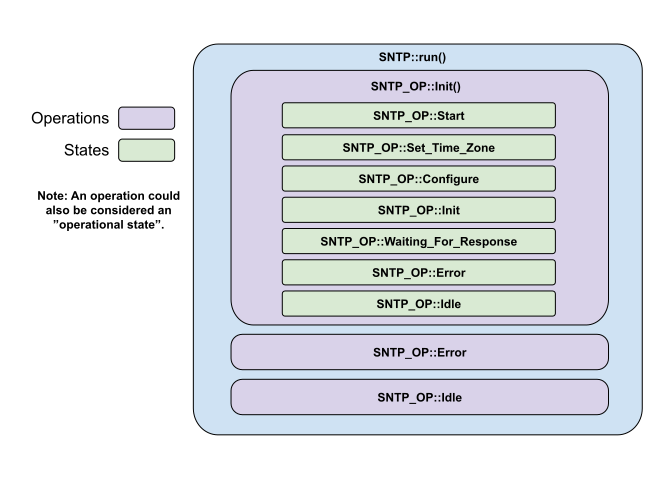

# SNTP Operations  
We define a list of SNTP operations in sntp_enum.hpp.  There are currently 3.  These operations lead to all other sub-operations within the sntp object.

There is no run operation here because the SNTP object has no run task.  SNTP is a support class to the Wifi and doesn't need very much processing power.  The Wifi object will call the SNTP::run() and it will route to initialization.   Once the SNTP object is initialized, it waits for events to arrive from the IDF that indicate that time information has been received.

* Init Operation
* Error Operation
* Idle Operation

### Init Operation
Most objects have an initialization startup requirement.  Initialization typically occurs right after the creation of the object and during this time the object is usually locked so the outside world can't interfere with it's initialization.   At this time, we don't look for RTOS communication.

### Error Operation
All Error operations everywhere try to handle any recoverable errors at the level for which they exist.  Usually, errors are forwarded on until they reach their highest level and then an error message is routed to a message handler.

### Idle Operation
Idle operation is more of a developmental tool where you can intercept unexepected results.
___  