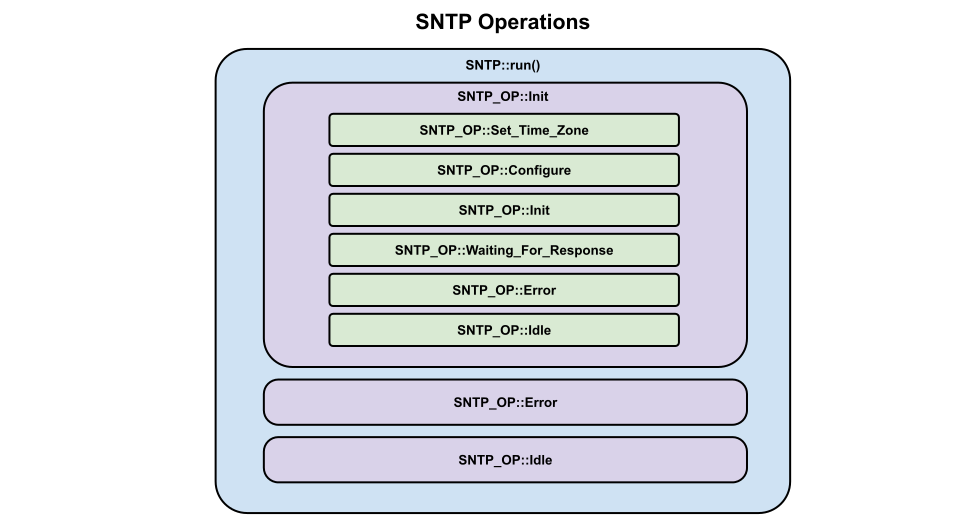

# SNTP Operations

We define a list of SNTP operations in sntp_enum.hpp.  There are currently 3.  These operations lead to all other sub-operations within the sntp object.

* Init Operation
* Error Operation
* Idle Operation

___  