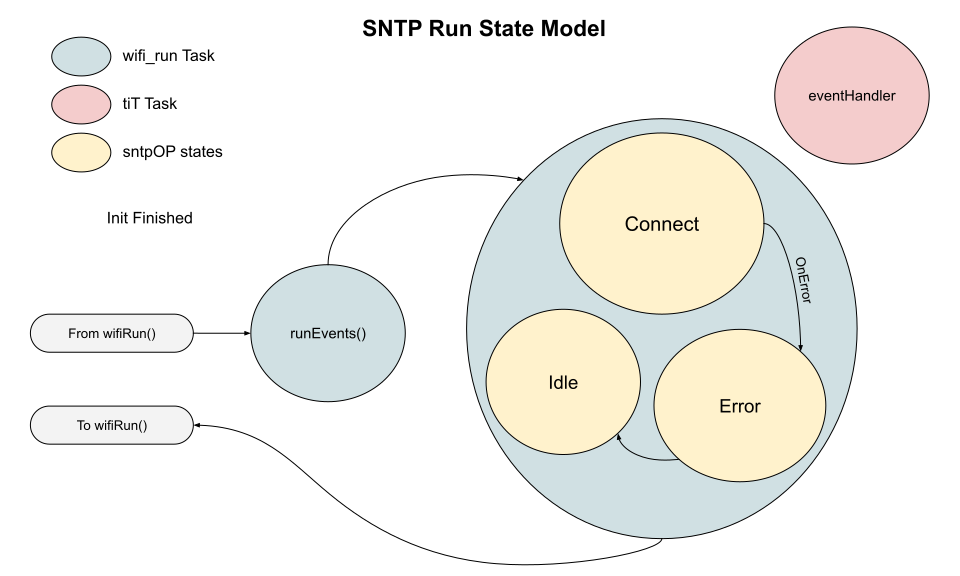
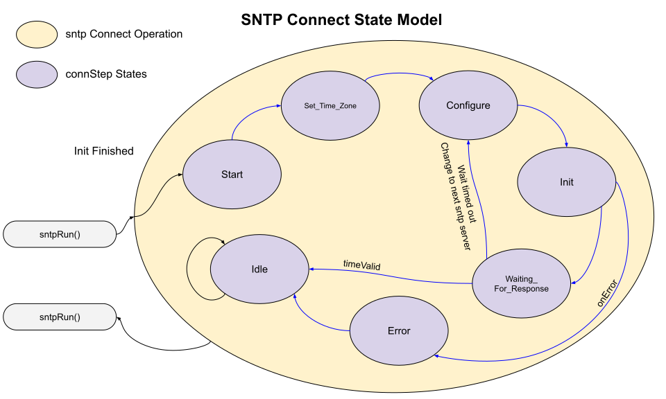

# SNTP State Transition Diagrams  
There is one state variable:
* sntpOP - Operation state.

___  
## Connection Operation
This runs only once at the start of the SNTP object.  It is responsible for getting the sntp client started inside the IDF.

___  
