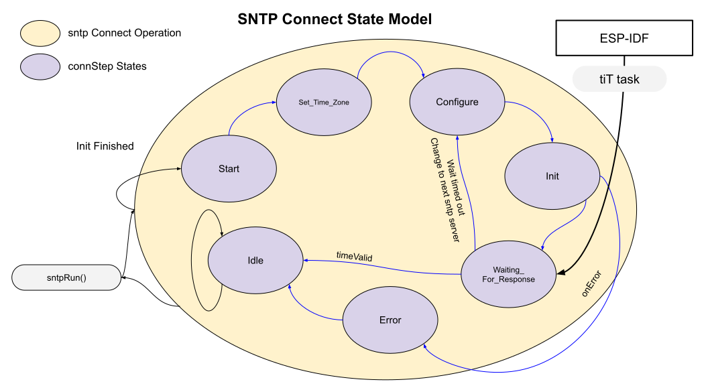

# SNTP State Transition Diagrams  
There is one state variable:
* sntpOP - Operation state.

___  
## Connection Operation
This runs only once at the start of the SNTP object.  It is responsible for getting the sntp client started inside the IDF.

Note: If an error occurs inside this operation, the sntpOP state is also changed to SNTP_OP::Error.  In essence, the connection error handler runs and this is followed by the primary error handler.  Not much happens in these error handlers beyond logging the error information.  Program progess is arrested on errors currently.

___  
