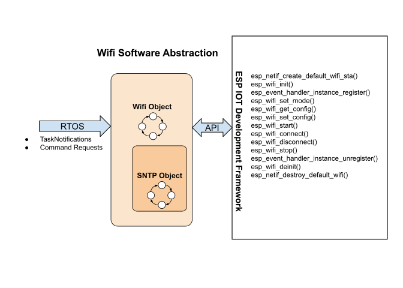

# Wifi Abstractions 
The wifi object runs an independant task and receives all its control and data through RTOS mechanisms or by reading data from NVS.

Simple Network Time Protocol is closely related to Wifi activitities so the Wifi also contain the SNTP object.  In the future, you can also expect that wifi provisioning and wifi mesh netorking to be contained here as well as they too are also both closely related to Wifi.

___  