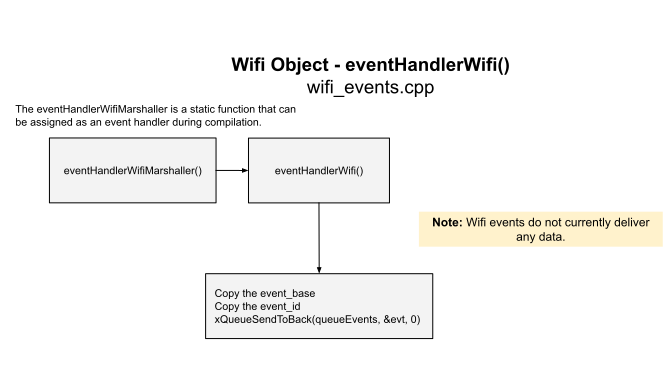
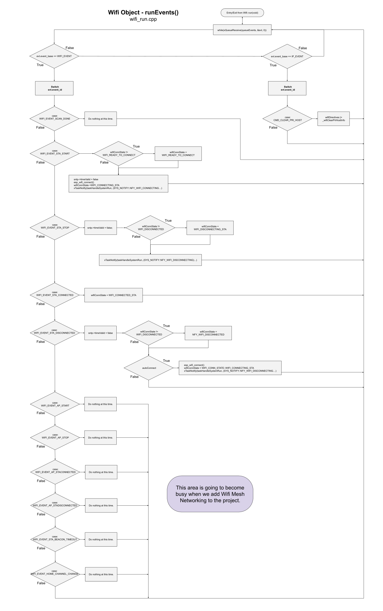

# Wifi Flowcharts
Here are the flowcharts that represent the wifi run task and the wifi event handler.  

Keep in mind that some logging and debugging statements have been omitted for clarity.  You may also see just a bit of pseudo code when this greatly simplifies the flowchart. 
___  
## wifi_run.cpp
This is the most important area of processing for the Wifi object.  
**NOTE: This drawing has become so large that you may not be able to view it inside a browser. You may be forced to download it and view locally.**  
  
___  
## wifi_events.cpp
Events arrive at the Wifi Object via the default event loop.  The default event loop is a Queue with a default size of 25 (and some amount of stack space).  Our strategy is always to quickly dispose of events by copying any provided data, and then marshelling that data over to the wifi_run task.  This makes all actions inside the event handling native to the Wifi object's run thread and removes any possible resource access conflict between the default event loop task and the wifi object's run task.  
  
___  
## wifi_run.cpp
Here is our Event handing.  This logically follows receiving events in the previous paragraph.  At this point, all event state data has been marshalled over to the wifi_run task.  We sequentially dispose of each event from our Queue and process as many events as are there (in a single entry).  Typically, there will only be one event in this queue, but two are more are possible though highly unlikely.  
  
___  