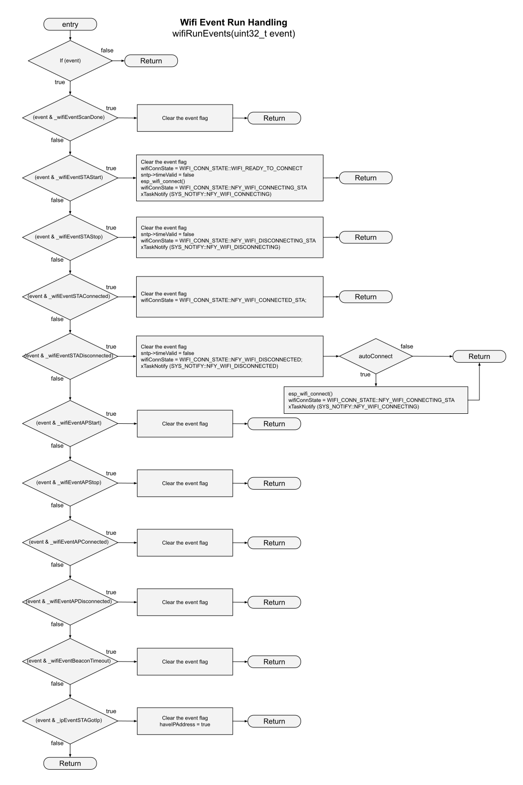
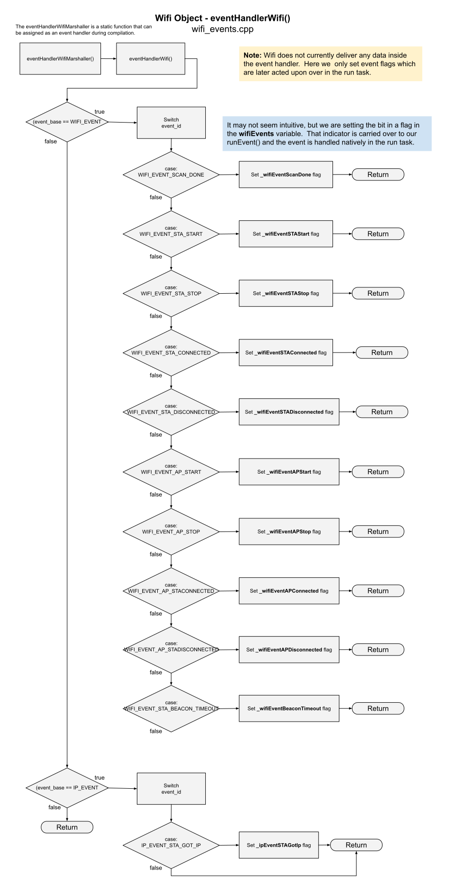

# Wifi Flowcharts
Here are the flowcharts that represent active task and the event handler.  

## wifi_run.cpp flowchart
This is the most important area of processing for the Wifi object.

**NOTE: This drawing has become so large that you may not be able to view it inside a browser. You may be forced to download it and view it locally.**

---  

Here is our Event handing in the run task:

---  

## wifi_events.cpp flowchart
Events arrive at the Wifi Object via the default event loop.  Our strategy is always to quickly dispose of events by copying any provided data, and then marshelling all operational action over to the Run task.  This makes all event handling native to the Wifi object's run thread and removes any possible resource access conflict between the default event loop task and the wifi object's run task.

First, this is raw event handling:
