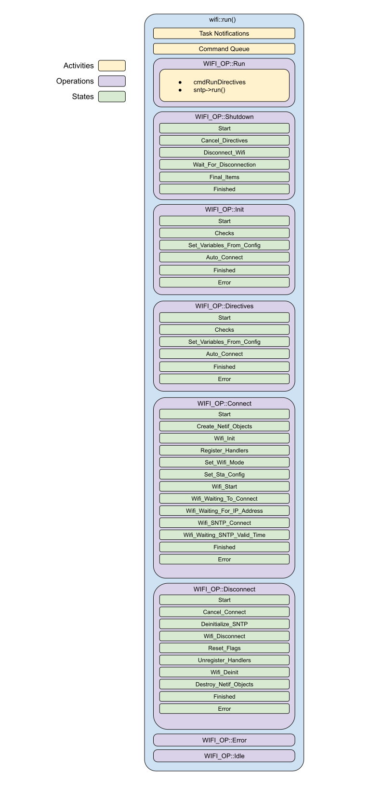

# Wifi Operations
We define a list of wifi operations in wifi_enum.hpp.  There are currently 8.  These operations lead to all other sub-operations within the Wifi object.

* Run Operation
* Shutdown Operation
* Init Operation
* Directive Operation
* Connect Operation
* Disconnect Operation
* Error Operation
* Idle Operation

___  