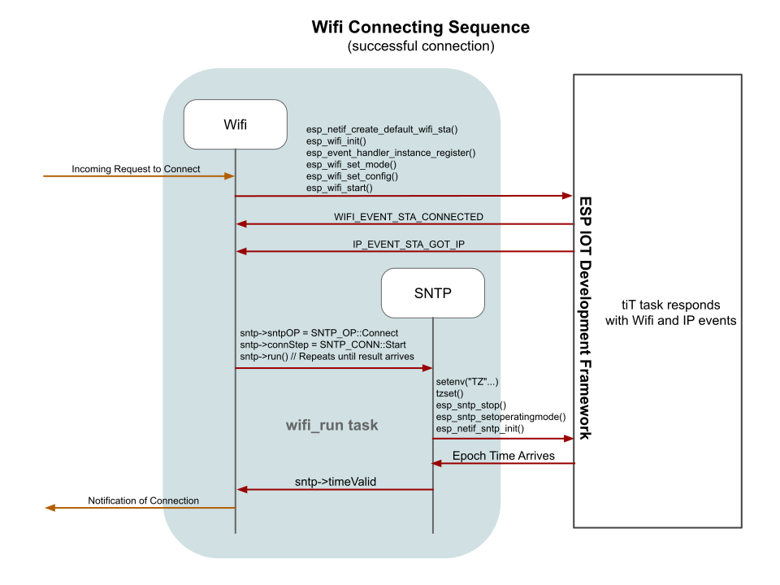
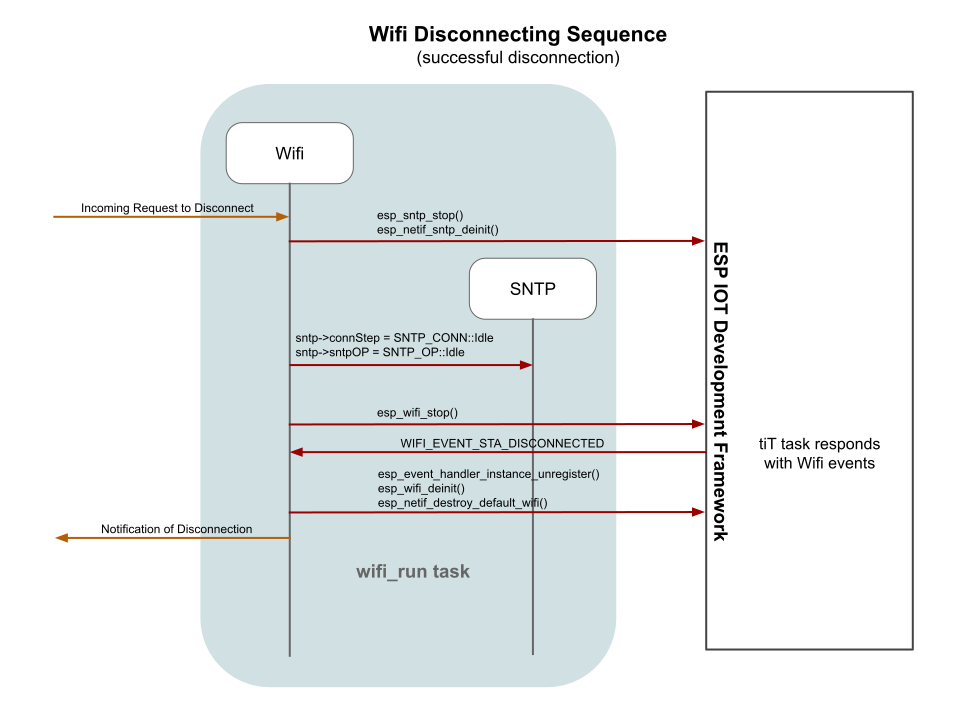

# Wifi Sequences  
Some of the sequences you may be interested in were mentioned previously in the System Sequences document.  Those topics include:
* The System Creating the Wifi Object
* The System Destroying the Wifi Object
* The System Calling on Wifi to Connect
* The System Calling on Wifi to Disconnect
Please refer to that document for those sequences.

Inside the Wifi object we can further detail and sequencing between Wifi calls and Event responses.

More detail with all the possible outcomes are included in the Wifi Object Run flowchart.
___  
Here we are examining the Wifi Disconnection sequence.

More detail with all the possible outcomes are included in the Wifi Object Run flowchart.
___  