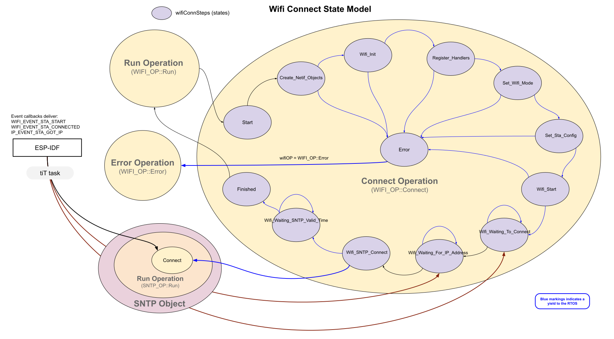

# Wifi State Transition Diagrams 
There is one state variable with eight opertional states:
* wifiOP - Operation state variable.

___  
This is the wifi connection state process.  Internally the wifiConnStep variable can hold thirteen WIFI_CONN states.  It is a bit complex in that it has 3 timer states that watch for WIFI_EVENT_STA_CONNECTED, IP_EVENT_STA_GOT_IP, and Epoch time.   If any of those timer states fail, the system restarts wifi.  This model isn't perfect, but it's fairly close to accurate.

___  
The disconnection state model is much simplier and there is very little to wait for.  Disconnection events do arrive fairly quickly.  

___   
The directives state process will be placed here...
___  
The shutdown state process will be placed here...
___  
