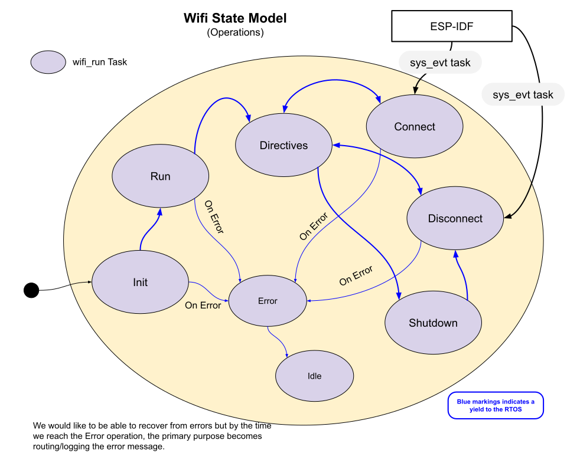

# Wifi State Transition Diagrams 
There is one state variable with eight opertional states:
* wifiOP - Operation state variable.

___  
The directives state model shows how we may progress through three prime objectives: Clearing data, Disconnecting from a Host, and Connecting to a Host.  This directives operation permits us the ability to "program" the Wifi object to carry out several actions (directives) on its own.

___  
This is the wifi connection state process.  Internally the wifiConnStep variable can hold thirteen WIFI_CONN states.  It is a bit complex in that it has 3 timer states that watch for WIFI_EVENT_STA_CONNECTED, IP_EVENT_STA_GOT_IP, and Epoch time.   If any of those timer states fail, the system restarts wifi.  This model isn't perfect, but it's fairly close to accurate.

___  
The disconnection state model is much simplier and there is nothing to wait for.  Disconnection events do arrive fairly quickly.  

___   
The shutdown process is fairly straightforward.  We do hand of control to the disconnection process and then it returns to the shutdown process.
___  
